# Learning Complex Group Behaviors in a Multi-Agent Competitive Environment

## Introduction

The aim of this project is to use reinforcement learning algorithms to explore predator-prey
dynamics, such as those seen when predator fish and prey fish interact in nature. In order to do so,
we have adapted OpenAI’s multiagent-particle-envs (Lowe et al.) to simulate two competing groups
of fish- a predator group (has a single predator) and a prey group (2 or 10 prey). We used 2 different
Q-learning algorithms (Q-Network with Experience Replay & Q-Network with Experience Replay and
Fixed Q-Target) and a Monte-Carlo Policy Gradient algorithm to train these predator and prey agents.
The predator is rewarded based on the number of times they collide with (“eat”) prey. The prey are
rewarded negatively for each collision with the prey (“every time they are eaten”). Using such reward
functions, the prey group is expected to learn defense strategies and the predator is expected to learn
attack strategies.

## Methods

Reinforcement learning is a branch of machine learning along with supervised and unsupervised
learning. The aim of reinforcement learning is for an agent to interact with its environment. By
interaction with the environment, the agent tries to learn the sequence of actions to take in particular
states that lead to the maximization of a reward signal.  
In the multi-agent setting, more than one agent is present and each agent learns independently of all
other agents.

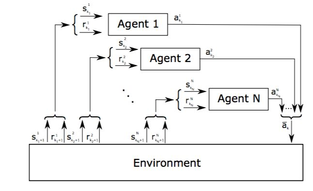

  **Figure 1:** A multiagent environment (Chincoli et. al).

Three RF(Reinforcement Learning) algorithms used in this project for agents to learn their optimal policies in order to maximize their expected cumulative feature reward.  

Details and derivations can be found on the **[paper](paper/Swarm.pdf)**.

### 1. Q-learning with experience replay

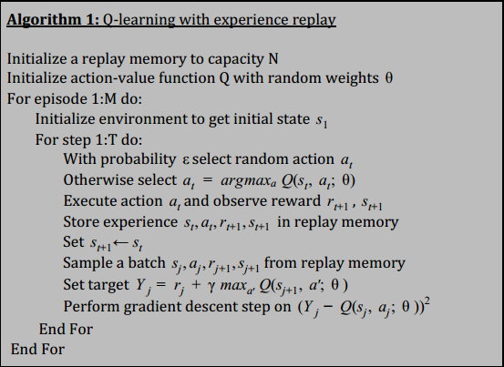

### 2. Q-learning with experience replay and a fixed Q-target network

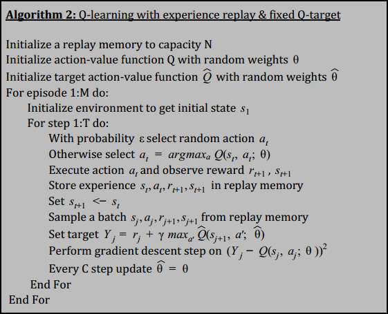

### 3. Monte-Carlo Policy Gradient

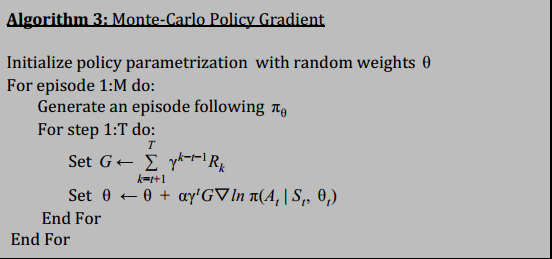

## Peformance

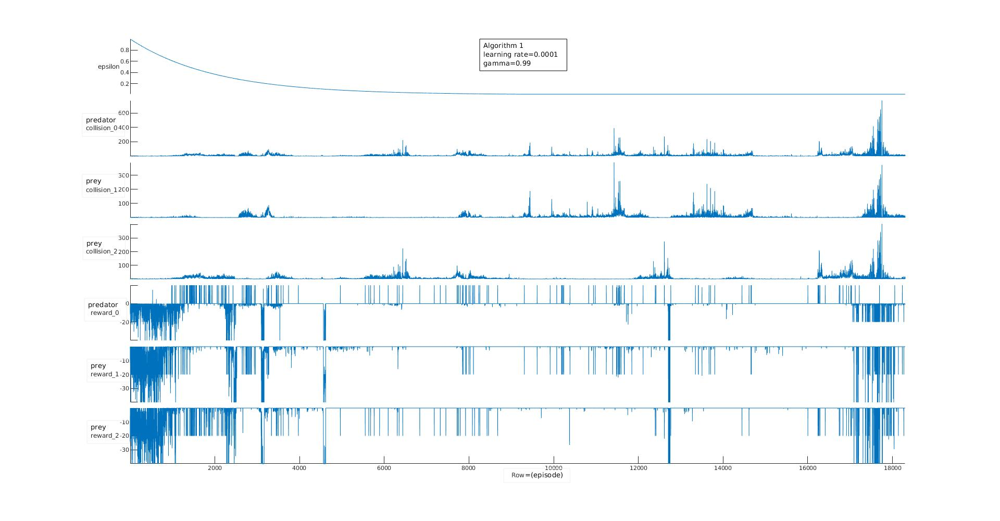

  **Figure 2:** Algorithm 1 Epsilon, Collision & Reward versus Episode are plotted for each agent. For this model, the learning rate = 0.0001 & gamma = 0.99

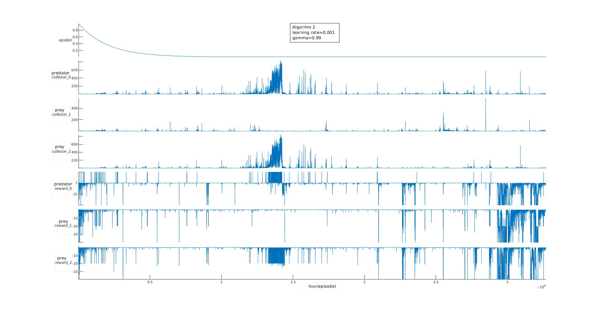

  **Figure 3:** Algorithm 2 Epsilon, Collision & Reward versus Episode are plotted for each agent. For this model, the learning rate = 0.001 & gamma = 0.99

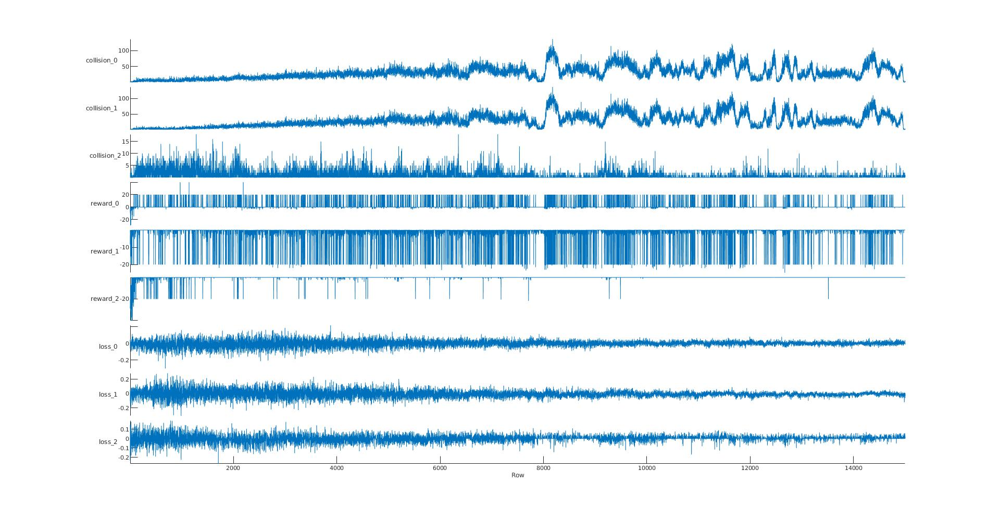

  **Figure 4:** Algorithm 3 Collision, Reward & Loss versus Episode are plotted for each agent. Agent 0: predator; agent 1 & agent 2: prey.

## Some of the Learned Strategies

### DPG 1v2

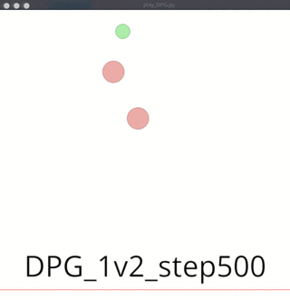 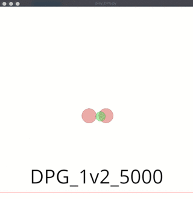

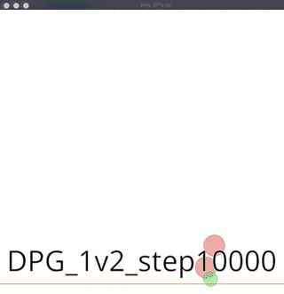 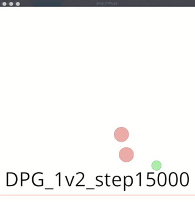

---

### DPG 2v1

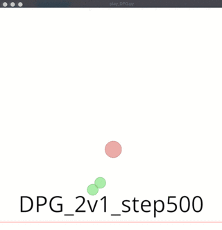 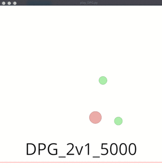

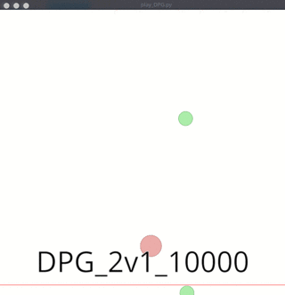 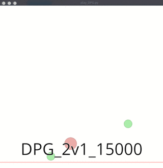

## References

Chincoli, Michele, and Antonio Liotta. "Self-learning power control in wireless sensor networks."
Sensors 18.2 (2018): 375.  

Lowe, Ryan, et al. "Multi-agent actor-critic for mixed cooperative-competitive
environments." Advances in Neural Information Processing Systems. 2017.  

Mnih, Volodymyr, et al. "Playing atari with deep reinforcement learning." arXiv preprint
arXiv:1312.5602 (2013).  

Matiisen, Tambet. “Demystifying Deep Reinforcement Learning.” 2015  

Sutton, Richard S., and Andrew G. Barto. Reinforcement learning: An
introduction. MIT press, 2018.  

Van Hasselt, Hado, Arthur Guez, and David Silver. "Deep Reinforcement Learning with Double
Q-Learning." AAAI. Vol. 2. 2016.
